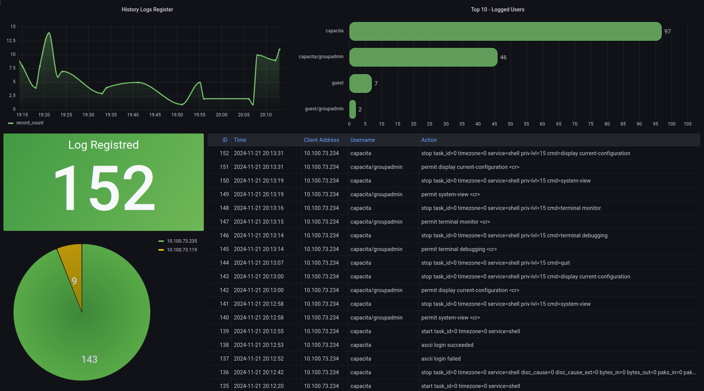

# TACACS+ Server Appliance with Docker

### This repository implements the [TACACS+](https://hub.docker.com/r/lfkeitel/tacacs_plus) images available on DockerHub to host and maintain an AAA server.



Prerequisites
Before you begin, ensure you have the following packages installed on your system:

- Git version 2.34.1
- Docker version 24.0.6, build ed223bc
- Docker Compose version v2.21.0

---

--- 
### Generating a MD5 Hash password to use on code: 

```
cadore@cadore:~$ openssl passwd -1 -stdin
teste
$1$ff03l9ua$d09W4ga2wujq2ekklt2iR1
```

Updating on tacacs_plus.conf:

```
    user = arthur {
        password = crypt $1$ff03l9ua$d09W4ga2wujq2ekklt2iR1
        member = ped
    }
```

### Getting Started:

First, copy the line below and paste it into your prompt to clone the repository:

```
git clone https://github.com/arthurcadore/capacita-tacacs
```
If you haven't installed the Git package yet, do it before trying to clone the repository!

Navigate to the project directory:

```
cd ./capacita-tacacs
```

If you don't have Docker (and Docker Compose) installed on your system yet, you can install it by running the following commands (Script for Ubuntu 22.04):

```
./installDocker.sh
```

**If you had to install Docker, please remember to reboot your machine to grant user privileges for the Docker application.** 

Next, configure the environment files for the application container. You can do this by editing the following files:

#### config/tac_plus.cfg -> Change the TACACS+ Server parameters for host access:

```
    host = world {
        address = 0.0.0.0/0
        enable = clear enable
        key = tac_plus_key
    }
```

#### config/tac_plus.cfg -> Change the TACACS+ Server parameters for user groups:
```
    group = groupadmin {
        default service = permit
        enable = permit
        service = shell {
            default command = permit
            default attribute = permit
            set priv-lvl = 15
        }
    }

    group = groupguest {
        default service = permit
        service = shell {
            default command = permit
            default attribute = permit
            set priv-lvl = 1
        }
    }

```

#### config/tac_plus.cfg -> Change the TACACS+ Server parameters for users and passwords:
```
    user = capacita {
        password = clear capacitapass
        member = groupadmin
    }

    user = guest {
        password = clear guestpass
        member = groupadmin
    }
```

### Start Application's Container: 
Run the command below to start docker-compose file: 

```
docker compose up & 
```
The "&" character creates a process id for the command inputed, which means that the container will not stop when you close the terminal. 

---

### Using Application Server:

Once the container is up and running, your devices can authenticate using TACACS+ connecting to `49/TCP` port, listening for TACACS authentication requests. 

### Configuring the device to authenticate into the TACACS+ Server: 

To configure the TACACS clients, you'll need to change the AAA parameters on the device and point it to ask the TACACS server about the user permissions. The repository has a configuration example for `SG 1002 MR L2+` Intelbras's switch, which you can access in `./example/switch-example.conf`. 

--- 

### TACACS authentication Logs:

You can see the authentication requests in `./log/tacacs.log`. Some example requests are displayed below:

```
2024-03-09 20:04:45 +0000	10.100.29.250	arthur	    32	10.123.123.10	shell login failed (no such user)
2024-03-09 20:04:45 +0000	10.100.29.250	carlos	    32	10.123.123.10	shell login failed (no such user)
2024-03-09 20:04:55 +0000	10.100.29.250	admin	    32	10.123.123.10	shell login succeeded
2024-03-09 20:05:17 +0000	10.100.29.250	capacita	32	10.123.123.10	shell login succeeded
2024-03-09 20:06:29 +0000	10.100.29.250	capacita	32	10.123.123.10	shell login succeeded
2024-03-09 20:06:58 +0000	10.100.29.250	capacita	32	10.123.123.10	shell login succeeded
2024-03-09 20:07:25 +0000	10.100.29.250	guest	    32	10.123.123.10	shell login succeeded
2024-03-09 20:08:09 +0000	10.100.29.250	guest	    32	10.123.123.10	shell login succeeded
```

--- 
### Stop Container: 
To stop the running container, use the following command:

```
docker-compose down
```

This command stops and removes the containers and networks defined in the docker-compose.yml file.

--- 

# References/Libraries used: 

[Base image (alpine-202104181633) used](https://hub.docker.com/r/lfkeitel/tacacs_plus)

[TACACS+ documentation for the server](http://www.pro-bono-publico.de/projects/unpacked/doc/tac_plus.pdf)